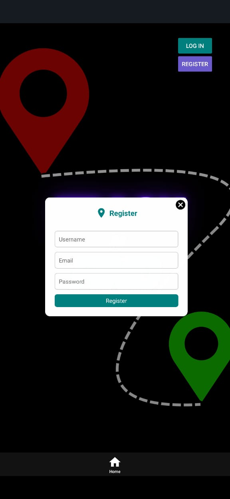
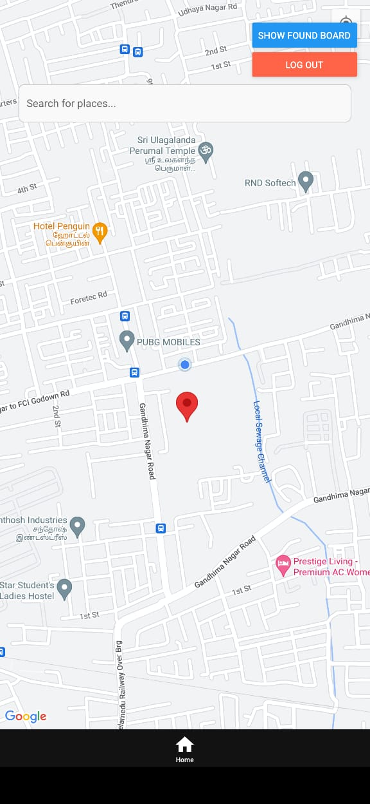
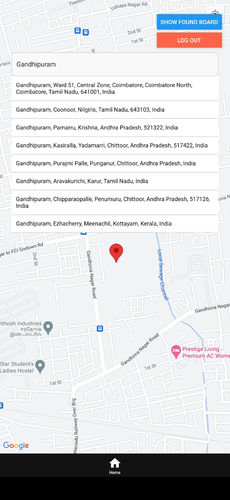
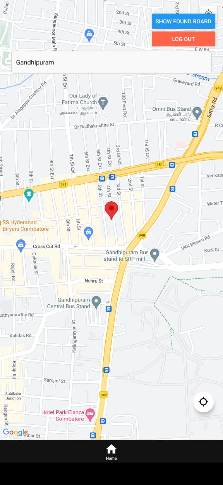
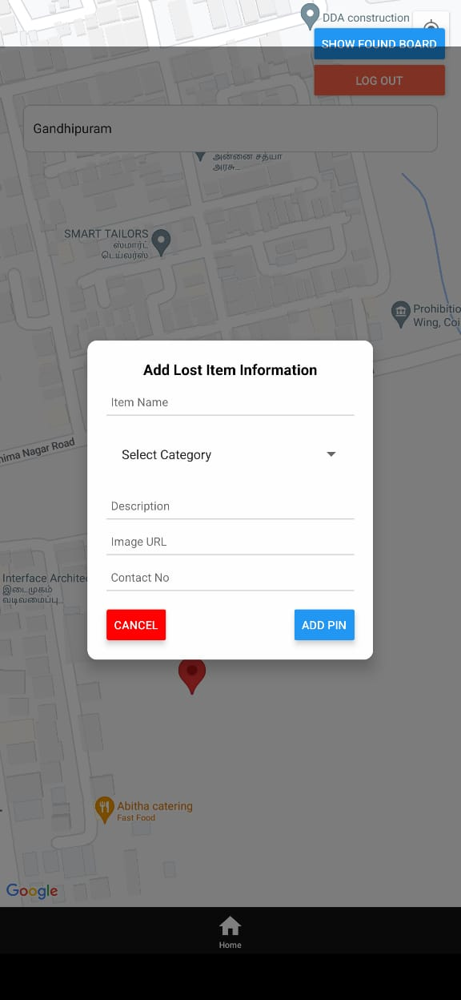
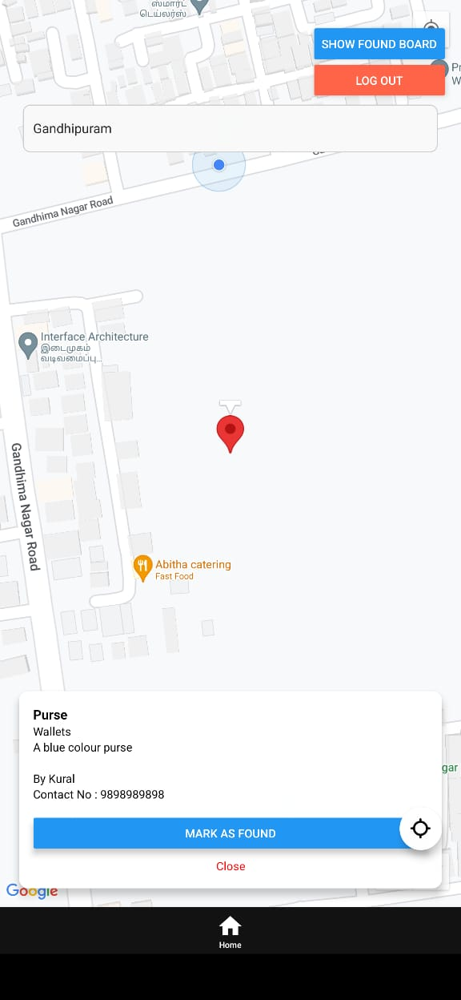
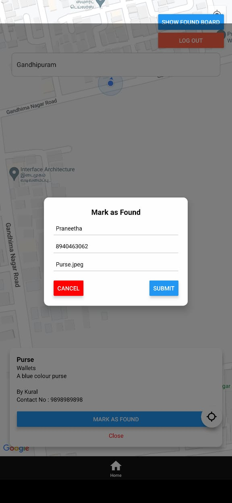
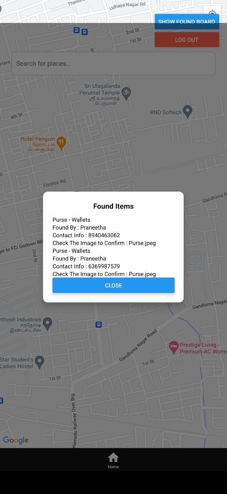

# TrackNFind
TrackNFind is a location-based mobile application that allows users to drop pins on a map and track locations. Users can create, view, and delete pins, making it easy to save important locations and navigate back to them later.

## Features
- **User Authentication**: Secure login and signup functionality.
- **Drop Pins**: Users can mark locations with custom notes.
- **View Pins**: Display all saved locations on a map.
- **Delete Pins**: Remove saved locations when they are no longer needed.
- **Interactive Map**: Utilizes map integration for seamless navigation.
  
  
  
  
  
  
  
  
## Tech Stack
- **Frontend**: React Native
- **Backend**: Node.js, Express.js
- **Database**: MongoDB
- **Maps**: Mapbox/Google Maps API

## Installation

### Prerequisites
- Node.js installed
- MongoDB running
- React Native setup

### Steps
1. Clone the repository:
   ```sh
   git clone https://github.com/dharshini2284/TrackNFind.git
   cd TrackNFind
   ```
2. Install dependencies:
   ```sh
   npm install
   ```
3. Set up environment variables:
   - Create a `.env` file in the root directory.
   - Add the required environment variables (api_keys , database URL).

4. Start the backend server:
   ```sh
   cd backend
   node index.js
   ```
5. Start the mobile app:
   ```sh
   cd frontend
   npx expo start -c
   ```

## API Endpoints
| Method | Endpoint            | Description          |
|--------|--------------------|----------------------|
| POST   | `/api/auth/register` | Register a new user |
| POST   | `/api/auth/login`    | Login user          |
| GET    | `/api/pins`          | Fetch all pins      |
| POST   | `/api/pins`          | Create a new pin    |
| DELETE | `/api/pins/:id`      | Delete a pin        |

## Usage
- Open the app and sign in.
- Use the map to drop pins at desired locations.
- View all saved pins on the map.
- Tap on a pin to delete it if needed.

## Troubleshooting
- If the map does not load, ensure that the API keys are correctly configured.
- If the backend does not start, check MongoDB connectivity.

## Contact
For any queries, feel free to reach out:
- Email: 004dharshkumar@gmail.com
- GitHub: [Dharshini A S](https://github.com/dharshini2284)

